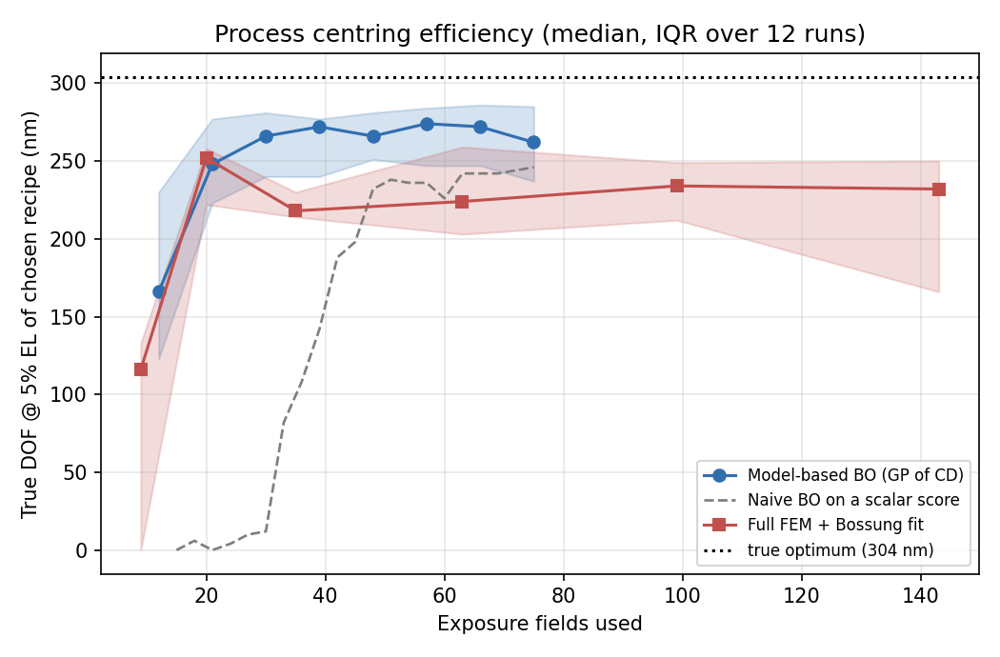
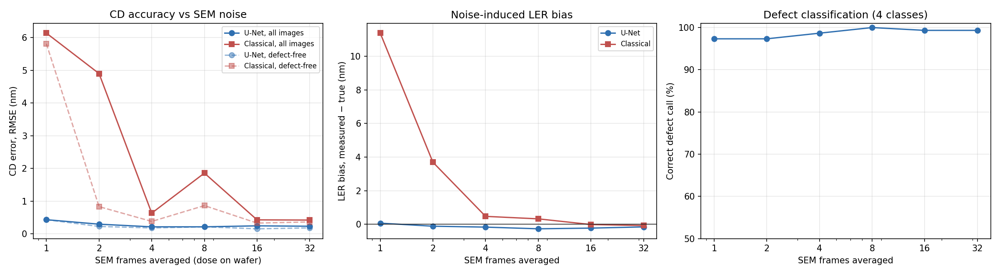
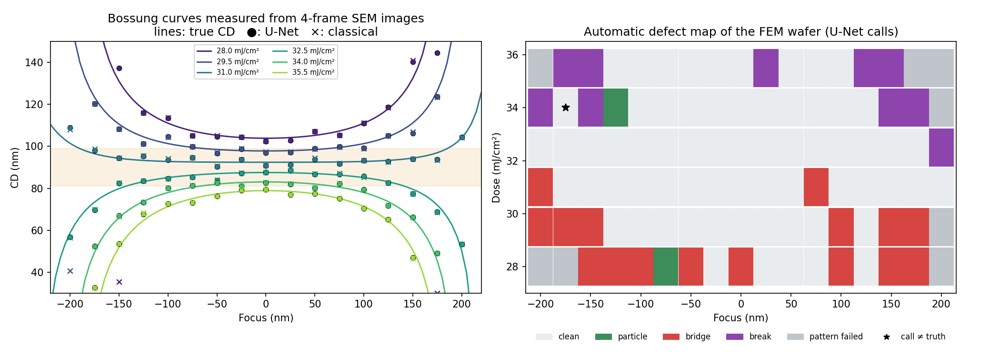

# AI for Photolithography Process Development

Physics-based lithography simulation, ML surrogate models, Bayesian process-window centring and
deep-learning CD-SEM image analysis, built end to end for a 90 nm line/space layer on a dry ArF scanner.

**Live demos (run in the browser):** https://USERNAME.github.io/litho-ai/ ·
**Walkthrough notebook:** [`notebooks/walkthrough.ipynb`](notebooks/walkthrough.ipynb) (runs in ~1 minute) ·
**Full results:** [`docs/TECHNICAL_REPORT.md`](docs/TECHNICAL_REPORT.md)

> All data is simulated. Production lithography data is confidential, so the project builds its own
> data from textbook physics. The simulator is not calibrated to a real resist or scanner: absolute
> numbers are illustrative; the methods and the comparisons are the point.

---

## Highlights

| | Result |
|---|---|
| **ML surrogate** of the litho simulator | CD within **2.6 nm** of truth in the 70–110 nm range (measurement noise there: 1.9 nm); **~2,000× faster** than the simulator |
| **Process-window centring** (dose × focus, noisy measurements) | Model-based Bayesian optimisation reaches **~88 % of the best achievable DOF in 30 exposure fields**; a 143-field focus-exposure matrix reaches 76 % |
| **CD-SEM metrology** with a U-Net, noisiest 1-frame scans | CD error **0.4 nm** vs 6.1 nm for a classical line-scan algorithm; LER bias **+0.1 nm** vs +11.4 nm |
| **Defect detection** (bridge, break, particle) | **98.7 %** of 900 held-out images called correctly, with defect location |
| **Closed loop** | Bossung curves rebuilt from fast 4-frame SEM images: U-Net CD error 1.0 nm vs 20 nm classical; bridges and breaks mapped to the correct side of the window |

Negative results are reported too: plain Bayesian optimisation on a scalar score stalls (its noise is
as large as its signal), and with four process knobs BO only matches a grid of FEMs.





---

## What is in the project

**Phase 1 — process modelling and optimisation**
1. **Simulator** (`litho_ai/simulator.py`): Abbe partially coherent imaging with defocus and
   spherical aberration, thickness-averaged image, swing curve, acid generation, Arrhenius PEB
   diffusion and deprotection, development threshold, LER proxy, scanner and CD-SEM noise.
   Reproduces Bossung curves with an isofocal dose and pitch-dependent best focus.
2. **Dataset**: 8,000 fields, Latin hypercube over dose, focus, pitch, resist thickness, PEB
   temperature and time.
3. **Surrogates** (`train_surrogate.py`): MLP and XGBoost for CD, print/fail and LER. The MLP wins
   (CD is smooth in the knobs; trees approximate it in steps).
4. **Process window and centring** (`process_window.py`, `bo_centring.py`, `centring_4knob.py`):
   exposure–defocus analysis, Gaussian-process BO against a classical FEM + Bossung fit.
5. **Recipe Console** (`docs/recipe-console.html`): the MLP running in the browser.

**Phase 2 — CD-SEM image analysis**

6. **Synthetic SEM images** (`sem.py`): correlated edge roughness, edge brightening, charging,
   beam blur, Poisson shot noise, scan-line jitter; bridges, breaks and particles with pixel labels.
7. **U-Net** (`sem_unet.py`): 0.93 M parameters, 5 pixel classes; sub-pixel CD and LER per scan row,
   defect type and location from the same map (`sem_metrology.py`).
8. **Evaluation** (`sem_eval.py`): against a classical line-scan algorithm across 1–32 frames, and a
   virtual FEM wafer measured entirely from SEM images.
9. **CD-SEM Inspector** (`docs/cd-sem-inspector.html`).



---

## Quick start

```bash
git clone https://github.com/USERNAME/litho-ai.git && cd litho-ai
pip install -r requirements.txt
jupyter notebook notebooks/walkthrough.ipynb     # uses the trained models in models/
```

Rebuild everything from scratch (about 1.5 h on 2 CPU cores): `bash run_all.sh`

```
litho_ai/     simulator, dataset, surrogates, BO, SEM rendering, U-Net, metrology, evaluation
notebooks/    walkthrough.ipynb (executed) and the script that builds it
models/       trained weights (MLP as JSON, XGBoost, U-Net) and all result JSON files
figures/      every figure in the report
docs/         GitHub Pages site: the two browser demos and the technical report
data/         Phase-1 dataset and evaluation outputs (SEM image sets are regenerated by script)
```

## Limitations and next steps

- **Calibration to real data**: fit the resist model to published dose-to-size / Bossung curves;
  test the U-Net on real SEM images (a few labelled images plus the synthetic set for domain adaptation).
- **Run-to-run control**: use SEM-measured CD to correct dose lot to lot (EWMA vs model-based).
- 1-D line/space patterns only; contacts and line ends need a 2-D model.

## Author

**Dr. Aishwarya Mellalakari** — PhD in Biomedical Engineering (IBEC / University of Barcelona,
Marie Skłodowska-Curie ITN Fellow); B.Tech + M.Tech in Nanotechnology. Background in cleanroom
microfabrication, multiphysics simulation (COMSOL) and deep-learning image analysis.

MIT License.
